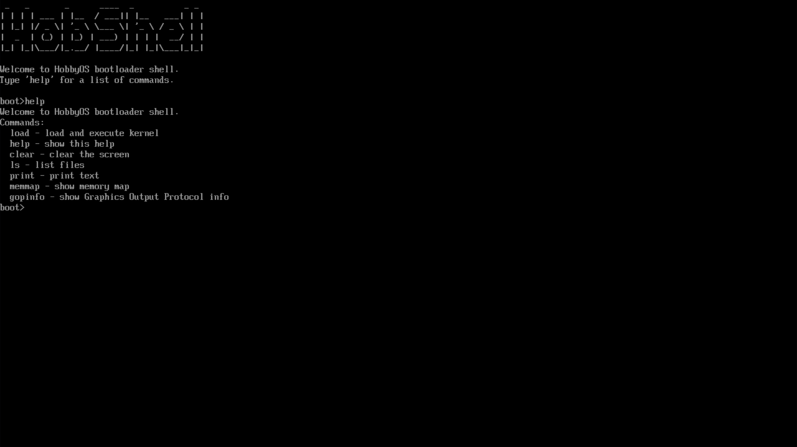

<h1 align="center">HobShell</h1>

<p align="center">
  An interactive <strong>UEFI shell</strong> that runs directly on firmware — before any operating system.
</p>

<p align="center">
  
  
  
  
</p>

---

<p align="center">
  
</p>

---

HobShell boots straight into a `boot>` prompt where you can explore the firmware
environment: browse the boot volume, dump the UEFI memory map, and inspect the
graphics output protocol. It's a small, freestanding UEFI application — a handy
starting point for firmware experiments and OS-dev bring-up.

```text
Welcome to HobbyOS bootloader shell.
boot>help
Commands:
  help    - show this help
  clear   - clear the screen
  ls      - list files
  print   - print text
  memmap  - show memory map
  gopinfo - show Graphics Output Protocol info
boot>ls
Files:
[DIR]  EFI
       kernel.elf (24576 bytes)
boot>
```

## Features

- **Interactive line editor** — `readline` with backspace and input flushing
- **Extensible command table** — register a command with a single array entry
- **`printf`-style formatter** (`VSPrint`) — `%d %u %x %s %c`, plus the `l`
  modifier (`%lx`, `%lu`) for 64-bit values
- **Built-in commands**
  | Command | Description |
  |---------|-------------|
  | `ls [path]` | list the boot volume (long format with sizes) |
  | `memmap` | decode and print the UEFI memory map |
  | `gopinfo` | resolution, pixel format, and framebuffer of the active GOP |
  | `print` · `clear` · `help` | basics |

## Quick start

**Prerequisites**

| Tool | Purpose | Arch package |
|------|---------|--------------|
| `clang` + `lld` | cross-compile to a PE UEFI image | `clang lld` |
| gnu-efi headers | UEFI type/protocol definitions (`/usr/include/efi`) | `gnu-efi` |
| `qemu-system-x86_64` | run the image | `qemu-full` |
| OVMF firmware | UEFI firmware for QEMU | `edk2-ovmf` |

**Build**

```sh
make
```

Produces `BOOTX64.EFI` and stages it at `diskimg/EFI/BOOT/BOOTX64.EFI`, where
UEFI firmware looks for a bootable image on a removable volume.

**Run**

The `run` target expects the OVMF firmware images in a local `OVMF/` directory
(they're gitignored — supply them from your distro):

```sh
mkdir -p OVMF
cp /usr/share/edk2/x64/*.fd OVMF/
make run
```

QEMU boots OVMF, which launches `BOOTX64.EFI` from the `diskimg` FAT volume and
drops you at the `boot>` prompt.

> Firmware paths vary by distro — `/usr/share/OVMF` on Debian/Ubuntu,
> `/usr/share/edk2/ovmf` on Fedora — and files may be named `OVMF_CODE_4M.fd`.
> `OVMF_CODE` is read-only; keep a **per-project writable copy** of `OVMF_VARS`.

## Project layout

```text
uefi.c          efi_main + REPL loop
uefi_base.c/.h  init, memory, input (readline), VSPrint, files, memory map
shell_helper.c  commands, dispatcher, and the command table
Makefile        build (clang -> PE) and run (qemu + OVMF)
```

## Related

HobShell is also the foundation of the bootloader in
**[hobbyOS](https://github.com/Soham-Kakkar/hobbyOS)**, where it grows an ELF64
kernel loader and a boot-info handoff. This repository is the standalone shell:
it depends on no kernel or OS headers and builds on its own.
